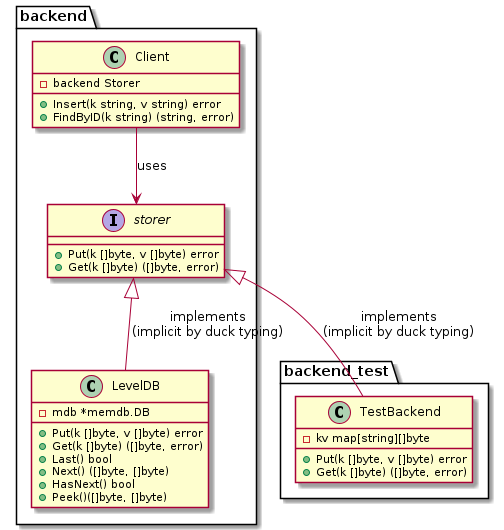

# DI & IoC in Go - How and Why

## The client library

A client library, which gives access to a Key/Value backend (K/V) may look like this:

```go
package backend
type Client struct {
 mdb *memdb.DB
}
func NewClient() *Client {
 return &Client{
  mdb: memdb.New(comparer.DefaultComparer, 0),
 }
}
func (cli *Client) Insert(k string, v string) error {
 return cli.mdb.Put([]byte(k), []byte(v))
}
func (cli *Client) FindByID(k string) (string, error) {
 b, err := cli.mdb.Get([]byte(k))
 return string(b[:]), err
}
```


Here the Client library provides both the insertion et retrieval methods.

## Dependency Injection

Now assume we want to unit-test the Client. How can we test our Client when all of the K/V code is hardwired ?

For each test to run, we would need the K/V backend. So let us define a Storer interface:

```go
type Storer interface {
 Put(k []byte, v []byte) error
 Get(k []byte) ([]byte, error)
}
```

Let us also implement a concrete backend, which uses levelDB as its storage backend.

```go
type Backend struct {
 mdb *memdb.DB
}
func NewBackend() *Backend {
 return &Backend{
  mdb: memdb.New(comparer.DefaultComparer, 0),
 }
}
func (be *Backend) Put(k []byte, v []byte) error {
 return be.mdb.Put(k, v)
}
func (be *Backend) Get(k []byte) ([]byte, error) {
 return be.mdb.Get(k)
}
```

And let us rewrite the client so that it now depends on a Storer:

```go
type Client struct {
 db Storer
}
func NewClient(db Storer) *Client {
 return &Client{db}
}
func (cli *Client) Insert(k string, v string) error {
 return cli.db.Put([]byte(k), []byte(v))
}
func (cli *Client) FindByID(k string) (string, error) {
 b, err := cli.db.Get([]byte(k))
 return string(b[:]), err
}
```


Notice the client forwards data requests to its Storer dependency.

The Storer (which is a dependency of the client) is injected into the client at creation time. The caller initializes a client like so :

```go
  db := backend.NewBackend()
  cli := backend.NewClient(db)
  cli.Insert(key, value)
```

## Test & Mock

We can now test using a fake backend

```go
type TestBackend struct {
 kv map[string][]byte
}
func NewTestBackend() *TestBackend {
 return &TestBackend{
  kv: make(map[string][]byte),
 }
}
func (t *TestBackend) Put(k []byte, v []byte) error {
 t.kv[string(k[:])] = v
 return nil
}
func (t *TestBackend) Get(k []byte) ([]byte, error) {
 return t.kv[string(k)], nil
}

  db := backend.NewTestBackend()
  cli := backend.NewClient(db)
  cli.Insert(key, value)

```


## More Storer Methods

Now let us assume other parts of  the client library, which also use the Storer facility, need more Backend methods than Get/Put. For them, we have to extend the Storer interface.


We now have a problem. The compiler complains that our TestBackend does not fulfill the Storer interface anymore. So we must fix it by adding the missing functions ...

## IoC - Inversion of Control

With every new function in Storer, we break our existing TestBackend implementation. With large code bases, that leads to maintenance nightmares.

The problem is that our Client (and accompanying tests) depends on a type that they do not control. In this case, it is the Storer interface. To solve the problem, let us invert the control by introducing an unexported interface that declares only what is needed for the Client.



Thanks to Go's implicit interface implementation (i.e., duck typing): nothing changes for the users of our library.

## Conclusion

Do not export interfaces. 

Export concrete implementations. 

If consumers need an interface, let them define it in their own scope !
