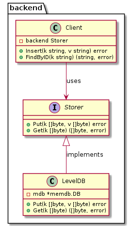

# ioc-go

DI then IoC in Go - Why

## Key concepts

### The origins of Go

Go is sometimes described as a *C-like language*, or as *C for the 21st century*. From C, Go inherited its expression syntax, control-flow statements ... Go is sometimes referred to as a Model T Ford with a Ferrari engine. (thanks to [Scriptol](https://www.scriptol.fr/programmation/go.php))

The figure below shows the most important influences of earlier programming languages on the design of Go (thanks to [O'Reilly](https://www.oreilly.com/library/view/the-go-programming/9780134190570/ebook_split_005.html)).

#### CSP

Communicating Sequential Processes (CSP) is a formal language for describing patterns of interaction in concurrent systems. CSP is the favored model for Go, but SHM is still available.
